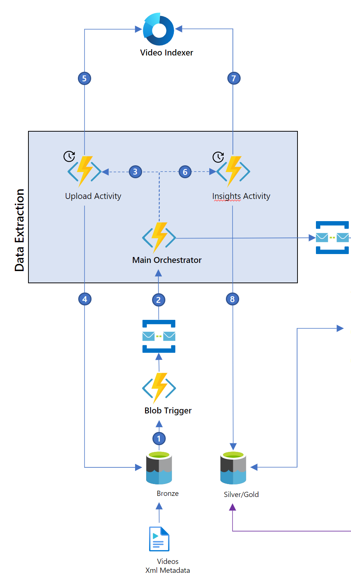

# Main Orchestrator

The Main Orchestrator is an [Azure durable function](https://docs.microsoft.com/en-us/azure/azure-functions/durable/durable-functions-overview?tabs=csharp) which coordinates all activities related to extracting insights from a video. It is called the "Main Orchestrator" in the architecture diagram, but it is known as the `InsightsExtractionOrchestrator` in the code. The code can be found under `src/dotnet/functions/func_extract/InsightsExtractionOrchestrator.cs`.

In the following explanatory text, numbers in brackets, e.g. (1), denote the corresponding numbers in the architecture diagram for reference.

When a new message is received from the blob trigger in the extract queue, the ServiceBusTrigger in the func extract function app starts the Main Orchestrator (2). The flow inside of the orchestrator is as follows:

1. Check if video is available for upload. If yes, proceed, if not, wait and try again later. The retry interval is currently set at 30 seconds. If the video is not available after 2 hours, an exception is thrown.

2. If the video is available, call the upload activity (3) which uploads the video to Video Indexer (5). Although this activity is called upload activity, technically it's a download, as the activity passes the video url to Video Indexer which will then directly copy the video from the blob storage for processing. In case the call to Video Indexer fails, this activity is also retried every 30 seconds for a maximum of 5 attempts. If it has not succeeded by then, an exception is thrown.

3. Check if insights are available from Video Indexer. If yes, proceed, if not, wait and try again later. The retry interval is currently set at 5 minutes. If the insights are not available after 2 hours, an exception is thrown.

4. If the insights are available, call the insights activity (6) which retrieves the insights from Video Indexer (7) and stores them in the silver storage (8). In case the call to Video Indexer fails, this activity is also retried every 30 seconds for a maximum of 5 attempts. If it has not succeeded by then, an exception is thrown.

5. Now that the video has been processed and insights have been stored, send a message to the dataproc queue to continue processing. In case the queue is not available, this activity is also retried every 30 seconds for a maximum of 5 attempts. If it has not succeeded by then, an exception is thrown.

All retry parameters are configurable in the code. This method of checking availability of resources before calling an activity is called a [monitor pattern](https://docs.microsoft.com/en-us/azure/azure-functions/durable/durable-functions-monitor?tabs=csharp).