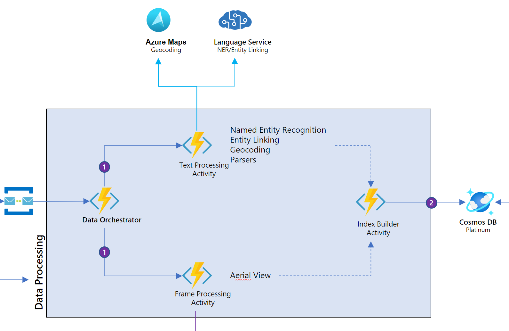

# Data Orchestrator

The Data Orchestrator is an [Azure durable function](https://docs.microsoft.com/en-us/azure/azure-functions/durable/durable-functions-overview?tabs=python) which coordinates all activities related to indexing the video insights for search. It is called "Data Orchestrator" in the architecture diagram, and is simply known as `orchestrator` in the code. The code can be found under `src/python/functions/func_dataproc/orchestrator`.

In the following explanatory text, numbers in brackets, e.g. (1), denote the corresponding numbers in the architecture diagram for reference.

When a new message is received from the func extract function app in the dataproc queue, the ServiceBusTrigger in the func dataproc function app starts the Data Orchestrator. The video id inside of the message is used to identify the video to be processed. The flow inside of the orchestrator is as follows:

1. Call the merge insights activity, which merges the insights from Video Indexer and the initial NewsML file into a single document. Also extract any insights from NER (Named Entity Recognition) service (1). In case one of the calls to another service fails, this activity is also retried every 5 seconds for a maximum of 3 attempts. If it has not succeeded by then, an exception is thrown.

2. Call the write insights activity, which writes merged insights into the Cosmos DB (2). In case the call to Cosmos DB fails, this activity is also retried every 5 seconds for a maximum of 3 attempts. If it has not succeeded by then, an exception is thrown.

All retry parameters are configurable in the code.