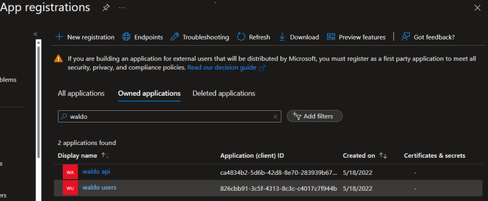
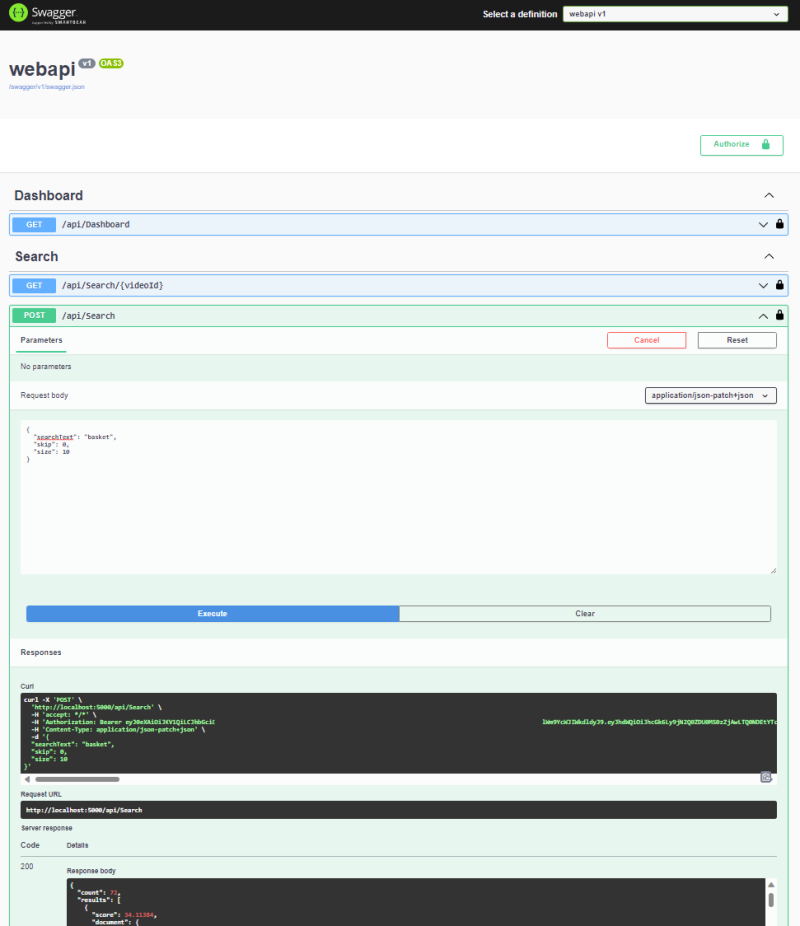
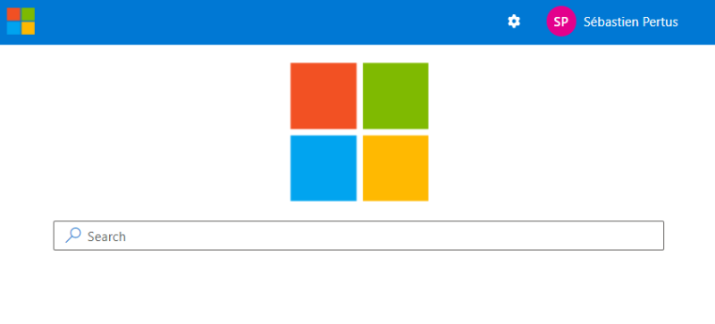

# Web Application (React) / Web API (.Net 6)

Before running the application, you need to :

- Deploy the infrastructure and the function apps.
- Once deployed, you will need to register the **Web API** and the **Web Application** applications with **Azure AD**.
- You will need the **Search Service** configuration keys as well as the **Video indexer** configuration keys.

Once the infrastructure is deployed, and you have all the configuration / applications keys, you can start registering the Web Api and the Web Application in Azure AD:

## Azure AD

There are **two** applications to register with Azure AD:

- First one (called **waldo api**) will protect the **Web API**. It will only allows authenticated queries (containing a valid bearer token) to access the web api endpoints, with the correct scope.
- Second one (called **waldo users**) will allow the user to authenticate himself and get a valid token used to access the Web API, once again with the correct scope.



### Register the Web API application (called **waldo api**)

The Web API application "**waldo api**" does not need to allow any user to authenticate. The main purpose of this application is to protect our Web API.

1. Navigate to the Microsoft identity platform for developers [App registrations](https://go.microsoft.com/fwlink/?linkid=2083908) page.
2. Select **New registration**.
3. In the **Register an application page** that appears, enter your application's registration information:
   - In the **Name** section, enter an application name, for example `waldo api`.
   - Under **Supported account types**, select **Accounts in this organizational directory only (Microsoft only - Single tenant)**.
   - Select **Register** to create the application.
4. In the app's registration screen, find and note the **Application (client) ID**. You use this value in your app's configuration file(s) later in your code.
5. Select **Save** to save your changes.
6. In the app's registration screen, select the **Expose an API** blade to the left to open the page where you can declare the parameters to expose this app as an API for which client applications can obtain [access tokens](https://docs.microsoft.com/azure/active-directory/develop/access-tokens) for.
The first thing that we need to do is to declare the unique [resource](https://docs.microsoft.com/azure/active-directory/develop/v2-oauth2-auth-code-flow) URI that the clients will be using to obtain access tokens for this API. To declare an resource URI, follow the following steps:
   - Click `Set` next to the **Application ID URI** to generate a URI that is unique for this app.
   - For this sample, we are using the default URI pattern (api:///{clientId}) by selecting **Save**.
7. All APIs have to publish a minimum of one [scope](https://docs.microsoft.com/azure/active-directory/develop/v2-oauth2-auth-code-flow#request-an-authorization-code) for the client's to obtain an access token successfully. To publish a scope, follow the following steps:
   - Select **Add a scope** button open the **Add a scope** screen and Enter the values as indicated below:
        - For **Scope name**, use `User.Impersonation`.
        - Select **Admins and users** options for **Who can consent?**
        - Keep **State** as **Enabled**
        - Click on the **Add scope** button on the bottom to save this scope.

> In the **Authorized client applications** section, you identify the applications that you want to authorize to your API. Each of the following IDs needs to be pre-registered in the **App registrations** section. In this sample, the `waldo users` application must be registered.
> Since we did not create it yet, we will do it later.

### Register the Client application (called **waldo users**)

The Client application **waldo users** will allow the users to authenticate, and will expose a scope to the Web Api application.

1. Navigate to the Microsoft identity platform for developers [App registrations](https://go.microsoft.com/fwlink/?linkid=2083908) page.
2. Select **New registration**.
3. In the **Register an application page** that appears, enter your application's registration information:
   - In the **Name** section, enter an application name that will be displayed to users, for example `waldo users`.
   - Under **Supported account types**, select **Accounts in this organizational directory only (Microsoft only - Single tenant)**.
4. Select **Register** to create the application.
5. In the app's registration screen, find and note the **Application (client) ID**. You use this value in your app's configuration file(s) later in your code.
6. In the app's registration screen, select **Authentication** in the menu.
   - If you don't have a platform added, select **Add a platform** and select the **Single-page application** option.
   - In the **Redirect URIs** | **Suggested Redirect URIs for public clients (mobile, desktop)** section, select **<http://localhost:5000/swagger/oauth2-redirect.html>**
   - Select again **Add a platform** and select the **Single-page application** option.
   - In the **Redirect URIs** | **Suggested Redirect URIs for public clients (mobile, desktop)** section, select **<http://localhost:3000>**
7. Select **Save** to save your changes.

> **First uri** (<http://localhost:5000/swagger/oauth2-redirect.html>) is used by the swagger ui to authenticate the user and allows him to use the swagger page.
> **Second uri** (<http://localhost:3000>) is used by the client application to authenticate the user and allows him to use the web application.

**Do not** activate the implicit flow, as we are using the **new Authorization Code Flow with PKCE** (<https://oauth.net/2/pkce/>)

1. In the app's registration screen,the **Certificates & secrets** blade in the left allow us to generate secrets and / or upload certificates.
   - As we are authenticating the user directly from the javascript client, without having to rely on a web application proxy, we don't need to generate any secret here.

2. In the app's registration screen, click on the **API permissions** blade in the left to open the page where we add access to the APIs that your application needs.
   - Click the **Add a permission** button and then,
   - Ensure that the **My APIs** tab is selected.
   - In the list of APIs, select the API `waldo api`.
   - In the **Delegated permissions** section, select the **User.Impersonation** in the list.
   - Click on the **Add permissions** button at the bottom.

### Configure Known Client Applications in the Web API application

For a middle tier Web API to be able to call a downstream Web API, the middle tier app needs to be granted the required permissions as well.
However, since the middle tier cannot interact with the signed-in user, it needs to be explicitly bound to the client app in its Azure AD registration.
This binding merges the permissions required by both the client and the middle tier Web API and presents it to the end user in a single consent dialog. The user then consent to this combined set of permissions.

To achieve this, you need to add the client app's **Application Id** (`waldo users` in our sample), in the Web Api's Manifest, in the `knownClientApplications` property. Here's how:

1. In the [Azure portal](https://portal.azure.com), navigate to your `waldo api` app registration, and select **Expose an API** section.
2. In the Authorized client applications section, click on the **Add a client application** button.
3. In the textbox, fill the Client ID of the `waldo users` application.
4. Select the authorized scope `User.Impersonation`.
5. Click **Add application**

## Web API

Once the Azure AD configuration is done, we can configure the Web API application, the run the Web api application locally to check we can query the search index with a valid authenticated token.

### Configure the Web API application

Open the `appsettings.json` (from the  `/dotnet/web/api` folder) file and replace the following values:

``` json
  "AzureAd": {
    "Instance": "https://login.microsoftonline.com/",
    "Domain": "YOUR_DOMAIN.onmicrosoft.com",
    "TenantId": "YOUR TENANT ID",
    "ClientId": "WALDO USERS ID"
  },
```

- Domain is the name of your Azure AD tenant. You can find it in the Azure portal, in the Azure Active Directory overview section.
- TenantId is the Id of your Azure AD tenant. You can find it in the Azure portal, in the Azure Active Directory overview section.
- ClientId is the Id of the `waldo users` application. You can find it in the Azure portal, in the App registrations section.

``` json
  "Swagger": {
    "ClientId": "WALDO API ID",
    "Scopes": "api://WALDO USERS ID/User.Impersonation"
  },
```

- ClientId is the Id of the `waldo api` application. You can find it in the Azure portal, in the App registrations section.
- Scopes is the Id of the `User.Impersonation` scope. You can find it in the Azure portal, in the App registrations section.

``` json
"KeyVaultName": "KEYVAULT NAME",
"SEARCH-SERVICE-QUERY-KEY": "SECRET KEY" 
```

- The key vault name is the name of the key vault you created during the deployment. The key vault contains the search service query key that is used to query the search service.
- The secret key is the secret key of the search service. You can find it in the Azure portal, in the search service overview section.

> The Search service query key is stored in the key vault to avoid exposing it in app settings. The key vault is secured with a managed identity that is granted access to the search service. The managed identity is used by the Web API to retrieve the secret key from the key vault.
> The "SEARCH-SERVICE-QUERY-KEY" is optional and allows you to access the search service without having to deal with the keyvault. It's mainly used for development purposes. **DO NOT USE IT IN PRODUCTION**.

``` json
  "Search": {
    "ServiceName": "SEARCH SERVICE NAME",
    "IndexVideos": "SEARCH INDEX NAME"
  },
```

- ServiceName is the name of the search service. You can find it in the Azure portal, in the search service overview section.
- IndexVideos is the name of the index that contains the videos. You can find it in the Azure portal, in the search service overview section.

> The search service query key is either stored in the keyvault or in the appsettings.json file.

``` json
  "VideoIndexer": {
    "SubscriptionId": "SUBSCRIPTION GUID ID",
    "ResourceGroup": "RESOURCE GROUP NAME",
    "AccountName": "ACCOUNT NAME",
    "AccountId": "ACCOUNT GUID ID",
    "AccountLocation": "LOCATION"
  },
```

- SubscriptionId is the id of the subscription that contains the video indexer account. You can find it in the Azure portal, in the subscription overview section.
- ResourceGroup is the name of the resource group that contains the video indexer account. You can find it in the Azure portal, in the resource group overview section.
- AccountName is the name of the video indexer account. You can find it in the Azure portal, in the video indexer account overview section.
- AccountId is the id of the video indexer account. You can find it in the Azure portal, in the video indexer account overview section.
- AccountLocation is the location of the video indexer account. You can find it in the Azure portal, in the video indexer account overview section.

``` json
"DashboardUrl": "https://portal.azure.com/...................../providers/Microsoft.Portal/dashboards/dashboard-xxxxx"
```

- DashboardUrl is the url of the dashboard used to display the video indexer insights. Fill it if you want to have a direct link to the dashboard in the application.

### Run the Web API application

1. Open a terminal and navigate to the `dotnet/web/api` folder.
2. Run the following command to start the Web API application:

```console
dotnet run
```

Navigate to `https://localhost:5001/swagger/index.html` to check that the Web API is running.

> Note: the .vscode/launch.json file contains a configuration to run the Web API application in debug mode. You can use it to debug the Web API application.

If you Azure AD configuration is correct, you should be able to authenticate to the Web API and query the search index.

image.png

## React Application

The React application is a single page application that allows users to search videos in the search index and to play the videos.

### Configure the React application

Open the `src/dotnet/web/ui/.env` file and replace the following values:

``` env
REACT_APP_API_ROOT_URI=<WALDO WEB API ROOT URL>
REACT_APP_CLIENT_ID=<WALDO USERS AZURE AD APP ID>
REACT_APP_TENANT_ID=<TENANT ID>
REACT_APP_REDIRECT_URI=<WALDO WEB UI ROOT URL>
REACT_APP_SCOPES=<WALDO WEB API SCOPE USER IMPERSONATION>
REACT_APP_GRAPH_SCOPES=user.read,openid,profile,people.read,user.readbasic.all
REACT_APP_APPINSIGHTS_KEY=<APP INSIGHT KEY>  
```

- REACT_APP_API_ROOT_URI is the root url of the Web API application. If you are running the Web API application locally, set it to a **blank value**.
- REACT_APP_CLIENT_ID is the Id of the `waldo users` application. You can find it in the Azure portal, in the App registrations section.
- REACT_APP_TENANT_ID is the Id of your Azure AD tenant. You can find it in the Azure portal, in the Azure Active Directory overview section.
- REACT_APP_REDIRECT_URI is the root url of the Web application. If you are running the Web application locally, set it to a `http://localhost:3000`.
- REACT_APP_SCOPES is the Id of the `User.Impersonation` scope. You can find it in the Azure portal, in the App registrations section. It should starts with `api://....` and end with `/User.Impersonation`.
- REACT_APP_GRAPH_SCOPES is the list of scopes used to access the Microsoft Graph API. It should contains the following values: `user.read,openid,profile,people.read,user.readbasic.all`.
- REACT_APP_APPINSIGHTS_KEY is the instrumentation key of the Application Insights instance. You can find it in the Azure portal, in the Application Insights overview section.

### Run the React application

To be able to run the React application, you need to install the dependencies and start the application.

> Do not forget to run the Web API application before running the React application.

- Open a terminal and navigate to the `dotnet/web/ui` folder.
- Run the following command to start the React application:

```console
npm install
npm start
```

You should be able to load the React application in your browser at the following url: `http://localhost:3000`.
Once authenticated you should be able to make a first search.


